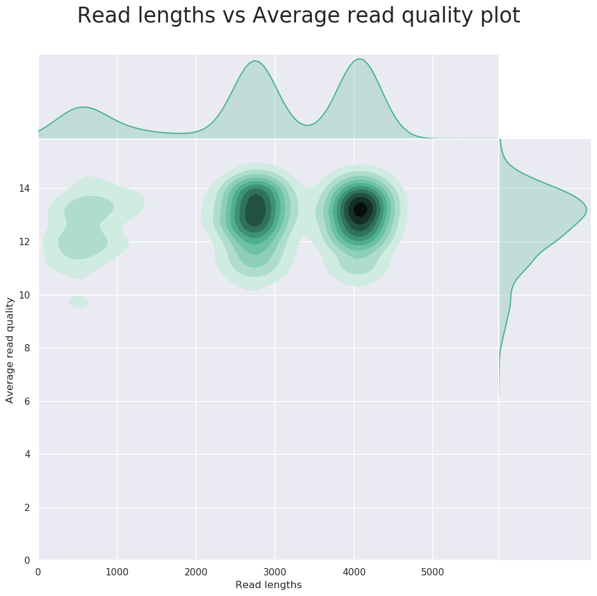
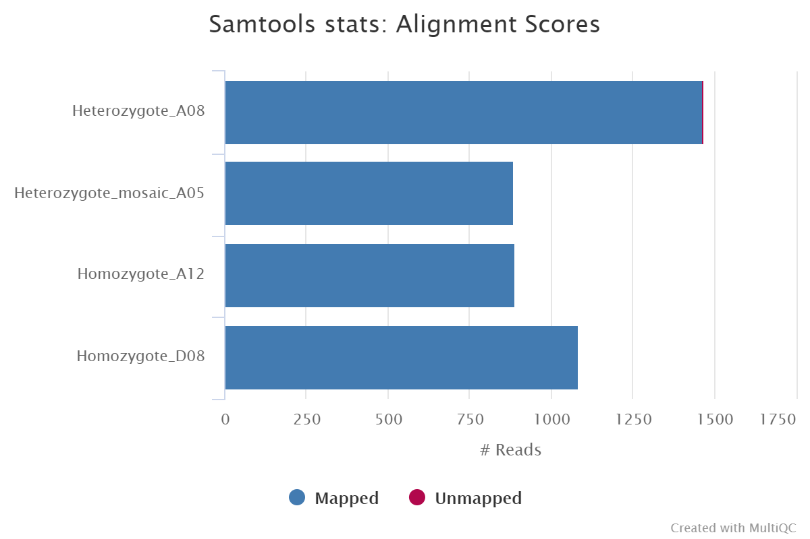

# nf-core/nanoseq: Output

This document describes the output produced by the pipeline. Most of the plots are taken from the MultiQC report, which summarises results at the end of the pipeline.

## Pipeline overview

The pipeline is built using [Nextflow](https://www.nextflow.io/). See [`main README.md`](../README.md) for a condensed overview of the steps in the pipeline, and the bioinformatics tools used at each step.

See [Oxford NanoPore website](https://nanoporetech.com/) for more information regarding the sequencing technology, protocol, and for an extensive list of resources.

The directories listed below will be created in the output directory after the pipeline has finished. All paths are relative to the top-level results directory.

## Basecalling and demultiplexing

*Documentation*:  
[Guppy](https://nanoporetech.com/nanopore-sequencing-data-analysis), [qcat](https://github.com/nanoporetech/qcat)

*Description*:  
The pipeline has been written to deal with the various scenarios where you would like to include/exclude the basecalling and demultiplexing steps. This will be dependent on what type of input data you would like to provide the pipeline. Additionally, if you would like to align your samples to a reference genome there are various options for providing this information. Please see [`usage.md`](usage.md#--input) for more details about the format of the input samplesheet, associated commands and how to provide reference genome data.

*Guppy* will be used to basecall and demultiplex the data. Various options have been provided to customise specific parameters and to be able to run *Guppy* on GPUs.

If you have a pre-basecalled fastq file then *qcat* will be used to perform the demultiplexing if you provide the `--skip_basecalling` parameter. If you would like to skip both of these steps entirely then you can provide `--skip_basecalling --skip_demultiplexing` when running the pipeline. As a result, the structure of the output folder will depend on which steps you have chosen to run in the pipeline.

*Output directories*:

* `guppy/fastq/`  
  Merged fastq output files for each barcode.
* `guppy/basecalling/<barcode*>/`  
  fastq output files for each barcode.
* `guppy/basecalling/unclassified/`  
  fastq files with reads were unassigned to any given barcode.
* `guppy/basecalling/sequencing_summary.txt`  
  Sequencing summary file generated by *Guppy*.
* `guppy/basecalling/sequencing_telemetry.js`  
  Sequencing telemetry file generated by *Guppy*.
* `guppy/basecalling/guppy_basecaller_log-<date>.log`  
  Log file for *Guppy* execution.
* `qcat/fastq/<barcode*>.fastq.gz`  
  fastq output files for each barcode.
* `qcat/fastq/none.fastq.gz`  
  fastq file with reads were unassigned to any given barcode.

## Sequencing QC

*Documentation*:  
[PycoQC](https://github.com/a-slide/pycoQC), [NanoPlot](https://github.com/wdecoster/NanoPlot)

*Description*:  
*PycoQC* and *NanoPlot* compute metrics and generate QC plots using the sequencing summary information generated by *Guppy* e.g. distribution of read length, read length over time, number of reads per barcode and other general stats. *NanoPlot* also generates QC metrics directly from fastq files as described in the next section.

*Output directories*:

* `pycoqc/pycoQC_output.html`  
  `*.html` file that includes a run summary and graphical representation of various QC metrics including distribution of read length, distribution of read quality scores, mean read quality per sequence length, output per channel over experiment time and percentage of reads per barcode.  
* `nanoplot/summary/`  
  `*.html` files for QC metrics and individual `*.png` image files for plots.

## FastQ QC

*Documentation*:  
[NanoPlot](https://github.com/wdecoster/NanoPlot), [FastQC](http://www.bioinformatics.babraham.ac.uk/projects/fastqc/Help/)

*Description*:  
*NanoPlot* can also be used to produce general quality metrics from the per-barcode fastq files generated by *Guppy* e.g. quality score distribution, read lengths and other general stats.

*FastQC* gives general quality metrics about your reads. It provides information about the quality score distribution across your reads, the per base sequence content (%A/C/G/T). You get information about adapter contamination and other overrepresented sequences.  

*Output directories*:

* `nanoplot/fastq/<SAMPLE>/`  
  Per-sample `*.html` files for QC metrics and individual `*.png` image files for plots.
* `fastqc/`  
  *FastQC* `*.html` and `*.zip` files.  

## Alignment

*Documentation*:  
[GraphMap2](https://github.com/lbcb-sci/graphmap2), [MiniMap2](https://github.com/lh3/minimap2), [SAMtools](http://samtools.sourceforge.net/)

*Description*:  
Reads are mapped to a user-defined genome or transcriptome using either *GraphMap2* or *Minimap2*, and the resulting BAM files are sorted and indexed. If the same reference is specified multiple times in the input sample sheet then the aligner index will only be built once for re-use across all samples. You can skip the alignment and downstream processes by providing the `--skip_alignment` parameter.

The initial SAM alignment files created by *GraphMap2* or *Minimap2* are not saved by default to be more efficient with storage space. You can override this behaviour with the use of the `--save_align_intermeds` parameter.

*Output directories*:

* `<ALIGNER>/`  
  Per-sample coordinate sorted alignment files in [`*.bam`](https://samtools.github.io/hts-specs/SAMv1.pdf) format.
* `<ALIGNER>/samtools_stats/`  
  *SAMtools* `*.flagstat`, `*.idxstats` and `*.stats` files generated from the alignment files.

## Coverage tracks

*Documentation*:  
[BEDTools](https://bedtools.readthedocs.io/en/latest/), [bedGraphToBigWig](https://genome.ucsc.edu/goldenpath/help/bigWig.html#Ex3), [`bedToBigBed`](https://genome.ucsc.edu/goldenPath/help/bigBed.html#Ex2)

*Description*:  
The [bigWig](https://genome.ucsc.edu/goldenpath/help/bigWig.html) format is in an indexed binary format useful for displaying dense, continuous data in Genome Browsers such as the [UCSC](https://genome.ucsc.edu/cgi-bin/hgTracks) and [IGV](http://software.broadinstitute.org/software/igv/). This mitigates the need to load the much larger BAM files for data visualisation purposes which will be slower and result in memory issues. The bigWig format is also supported by various bioinformatics software for downstream processing such as meta-profile plotting.

[bigBed](https://genome.ucsc.edu/goldenPath/help/bigBed.html) are more useful for displaying distribution of reads across exon intervals as is typically observed for RNA-seq data. Therefore, these files will only be generated if `--protocol directRNA` or `--protocol cDNA` are defined.

The creation of these files can be bypassed by setting the parameters `--skip_bigwig`/`--skip_bigbed`.

*Output directories*:

* `<ALIGNER>/bigwig/`  
  Per-sample `*.bigWig` files.
* `<ALIGNER>/bigbed/`  
  Per-sample `*.bigBed` files.

## MultiQC

*Documentation*:  
[MultiQC](https://multiqc.info/docs/)

*Description*:  
*MultiQC* is a visualisation tool that generates a single HTML report summarising all samples in your project. Most of the pipeline QC results are visualised in the report and further statistics are available within the report data directory.  

Results generated by *MultiQC* for this pipeline collate QC from *FastQC*, *samtools flagstat*, *samtools idxstats* and *samtools stats*.

The pipeline has special steps which also allow the software versions to be reported in the *MultiQC* output for future traceability. For more information about how to use *MultiQC* reports, see <http://multiqc.info>.

*Output directories*:  

* `multiqc/`  
  * `multiqc_report.html` - a standalone HTML file that can be viewed in your web browser.
  * `multiqc_data/` - directory containing parsed statistics from the different tools used in the pipeline.
  * `multiqc_plots/` - directory containing static images from the report in various formats.

## Pipeline information

*Documentation*:  
[Nextflow](https://www.nextflow.io/docs/latest/tracing.html)

*Description*:  
*Nextflow* provides excellent functionality for generating various reports relevant to the running and execution of the pipeline. This will allow you to trouble-shoot errors with the running of the pipeline, and also provide you with other information such as launch commands, run times and resource usage.

*Output directories*:

* `pipeline_info/`  
  * Reports generated by the pipeline - `pipeline_report.html`, `pipeline_report.txt` and `software_versions.csv`.
  * Reports generated by *Nextflow* - `execution_report.html`, `execution_timeline.html`, `execution_trace.txt` and `pipeline_dag.svg`.
  * Reformatted sample sheet files used as input to the pipeline - `samplesheet_reformat.csv`.
  * Documentation for interpretation of results in HTML format - `results_description.html`.
